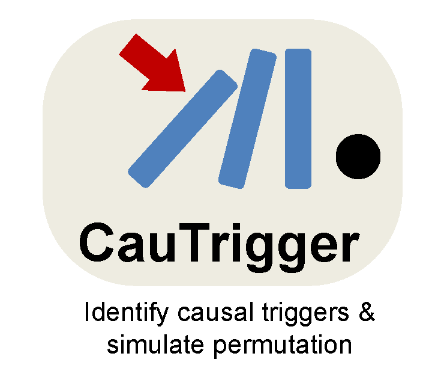
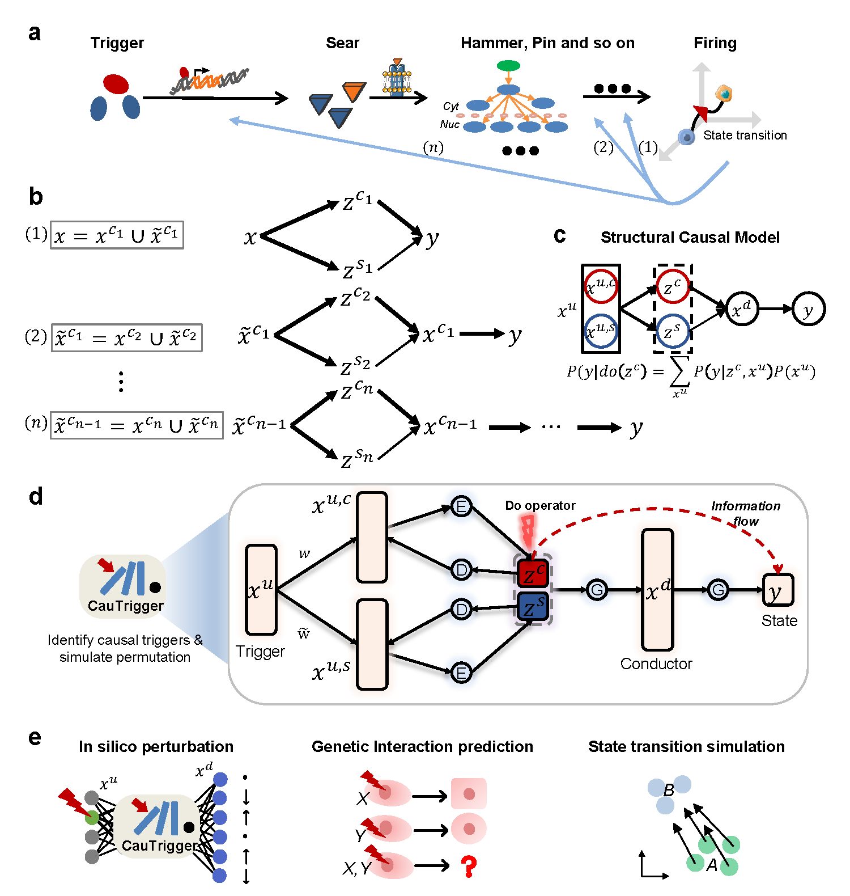

# CauTrigger (v0.1.0)

<div align="center">
  
</div>

Biological systems exhibit complex hierarchical regulation, where system states are governed by multilayered regulatory interactions. Understanding the causal architecture underlying these state transitions remains a major challenge due to confounding factors and the limitations of correlation-based analyses. To address this, we present CauTrigger, a hierarchical deep latent variable model that integrates do-calculus to identify potential causal triggers and predict perturbation outcomes. By disentangling causal and spurious latent factors, CauTrigger reconstructs the underlying regulatory hierarchy and enables interpretable reasoning over observational data.



Causal decoupling model constructed on a dual-flow variational autoencoder (DFVAE) framework to identify causal triggers influencing state transition. Triggers ($x^n$) are processed through a feature selection layer to separates causal triggers ($x^{c_n}$) and others ($\tilde{x}^{c_n}$ ), and then encoded them into latent space $z$ consists of causal ($z^{c_n}$) and spurious ($z^{s_n}$) components. This latent space is decoded to generate downstream conductors ($x^{c_{n-1}},...,x^{c_1}$) and to predict the final cell state ($y$). The model strives to maximize the causal information flow, $I(z^{c_n}→y)$, from $z^{c_n}$ to $y$, thus delineating the causal path from $x^{c_n}$ to $y$ via $z^{c_n}$.


## Installation
The installation process takes more than 3 to 10 minutes and is greatly dependent on the network speed.

```bash
git clone git@github.com:ChengmingZhang-CAS/CauTrigger-main.git
cd CauTrigger-main
conda create -n CauTrigger python==3.10
conda activate CauTrigger
pip install -r requirements.txt

# install torch
conda install pytorch==1.13.1 torchvision==0.14.1 torchaudio==0.13.1 pytorch-cuda=11.7 -c pytorch -c nvidia

python setup.py install
```


## Tutorials
### We provide one simulated AnnData objects in docs/adata.h5ad created in 'BenchmarkSimulation2L.ipynb' using cs=0.3 and p=0.1, for simple tests of causal decomposition and trigger identification.
```python
import pandas as pd
import scanpy as sc
from CauTrigger.utils import set_seed
from CauTrigger.model import CauTrigger3L, CauTrigger2L, CauTrigger1L
set_seed(42)

adata = sc.read_h5ad('adata.h5ad')

# === Step 1: layer1 → downstream (closer to Y) ===
layer1_vars = adata.var_names[adata.var["layer"] == "layer1"]
adata_layer1 = AnnData(
    X=adata.obsm["layer1"],
    obs=adata.obs.copy(),
    var=adata.var.loc[layer1_vars].copy()
)

model_1L = CauTrigger1L(
    adata_layer1,
    n_latent=10,
    n_hidden=128,
    n_layers_encoder=0,
    n_layers_decoder=0,
    n_layers_dpd=0,
    dropout_rate_encoder=0.0,
    dropout_rate_decoder=0.0,
    dropout_rate_dpd=0.0,
    use_batch_norm='none',
    use_batch_norm_dpd=True,
    decoder_linear=False,
    dpd_linear=True,
    init_weight=None,
    init_thresh=0.4,
    attention=False,
    att_mean=False,
)
model_1L.train(max_epochs=200, stage_training=True, weight_scheme="sim")
df_layer1, _ = model_1L.get_up_feature_weights(method=mode, normalize=False, sort_by_weight=True)
print("df_layer1", df_layer1.head(20))

# === Step 2: layer2 → upstream, use layer1 top-k as X_down ===
layer2_vars = adata.var_names[adata.var["layer"] == "layer2"]
df_layer1 = df_layer1.loc[layer1_vars]  # ensure order matches obsm["layer1"]
topk_indices = df_layer1["weight"].values.argsort()[-topk:]
X_down = adata.obsm["layer1"] if full_input else adata.obsm["layer1"][:, topk_indices]

adata_layer2 = AnnData(
    X=adata.obsm["layer2"],
    obs=adata.obs.copy(),
    var=adata.var.loc[layer2_vars].copy(),
    obsm={"X_down": X_down}
)

model_2L = CauTrigger2L(
    adata_layer2,
    n_latent=10,
    n_hidden=128,
    n_layers_encoder=0,
    n_layers_decoder=0,
    n_layers_dpd=0,
    dropout_rate_encoder=0.0,
    dropout_rate_decoder=0.0,
    dropout_rate_dpd=0.0,
    use_batch_norm='none',
    use_batch_norm_dpd=True,
    decoder_linear=False,
    dpd_linear=True,
    init_weight=None,
    init_thresh=0.4,
    attention=False,
    att_mean=False,
)
model_2L.train(max_epochs=200, stage_training=True, weight_scheme="sim")
df_layer2, _ = model_2L.get_up_feature_weights(method=mode, normalize=False, sort_by_weight=True)
print("df_layer2", df_layer2.head(10))
```


## License

This project is licensed under the MIT License - see the `LICENSE` file for details.

## Citation

If you use CauTrigger in your research, please cite the following paper:


## Contact

For questions or issues, please contact Chengming Zhang at zhangchengming@g.ecc.u-tokyo.ac.jp.
