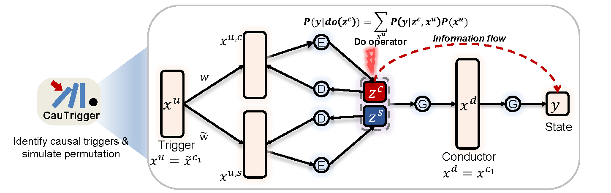

CauTrigger Documentation
=======================

Introduction
------------

CauTrigger is a powerful framework designed to identify potential causal triggers.

Overview
--------

The image above provides a high-level overview of the CauTrigger framework, illustrating its core components and workflow.

Contents
--------

.. toctree::
   :maxdepth: 1
   
   Installation.md
   Tutorial.md
   BenchmarkSimulation2L.ipynb
   BenchmarkSimulation2L_Hard.ipynb
   BenchmarkHESC.ipynb
   BenchmarkHESC2Fibroblast.ipynb
   BenchmarkPCC.ipynb
   BenchmarkPBMC.ipynb
   HESC_analysis.ipynb
   Case_axis_asd.ipynb
   Case_t2d_grn.ipynb

References
----------

If you use CauTrigger in your research, please cite the following paper:

